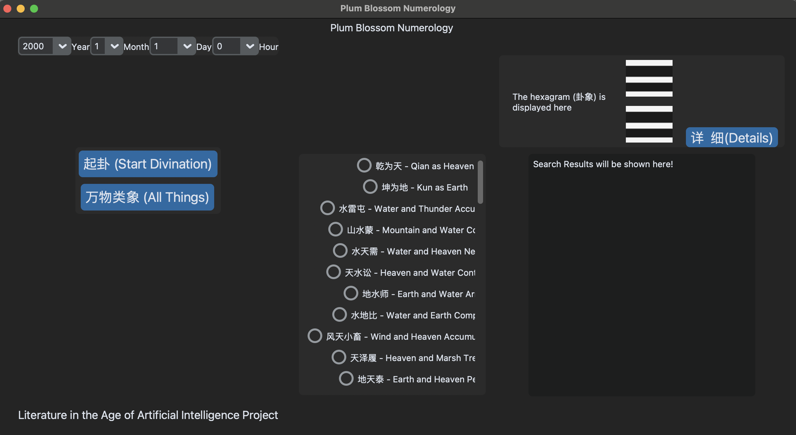
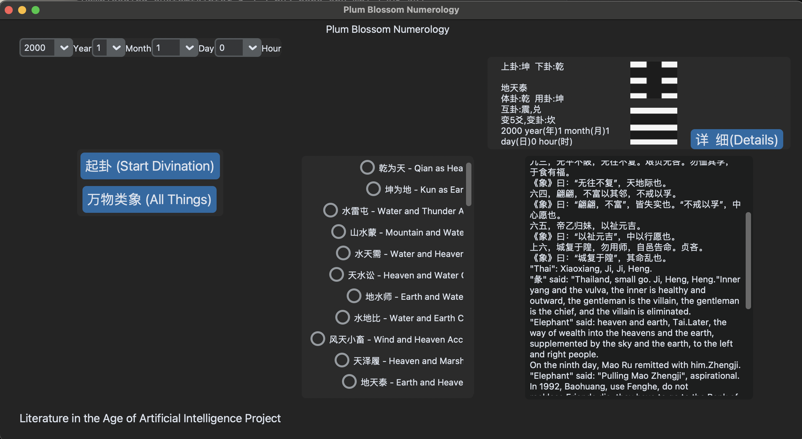
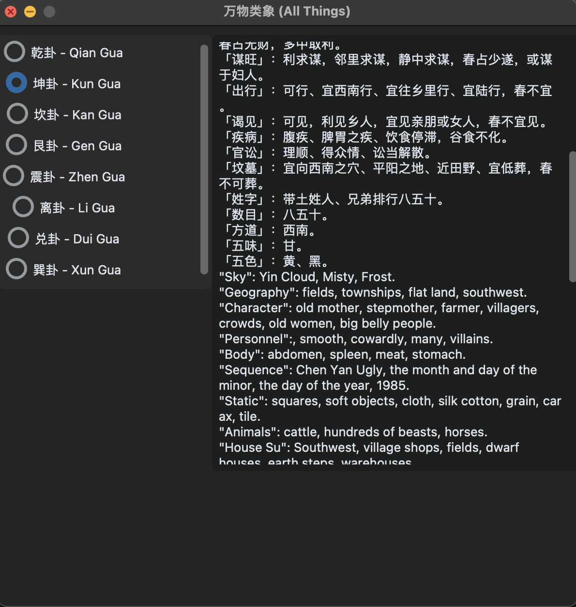

## Introduction

"Meihua Yishu," also known as "Plum Blossom Numerology," is a fascinating Chinese divination system that intricately combines the ancient wisdom of I Ching (the Book of Changes) with an individual's specific birth details to deliver insightful predictions. Attributed to the philosopher Shao Yong of the Northern Song Dynasty, this method harnesses the birthdate and hour of a person, linking these personal timestamps directly with the cosmic and natural forces depicted in the I Ching hexagrams.

Shao Yong's intellectual contributions to Chinese metaphysical thought are profound. His interpretations of the I Ching explore the deterministic aspects of the universe through numerical patterns and hexagram sequences. His philosophy posits that the universe is fundamentally knowable through these patterns, which he meticulously aligned with historical events and personal fate. His system, encapsulated in his work "Huangji Jingshi," serves as a cornerstone for "Meihua Yishu."

The plum blossom, which endures and blooms despite the harshness of winter, symbolizes the resilience and perpetual relevance of this divination method. It’s a metaphor for the endurance of wisdom through the ages—just as the plum blossoms persevere, so does the wisdom of the I Ching through various epochs of human civilization.

Further scholarly exploration, such as the studies by Wang (2017) and Zhao (2019), examines how "Meihua Yishu" aligns with broader Taoist philosophies and its implications for understanding personal and cosmic harmony. These studies delve into the adaptability of the I Ching's trigrams in predicting personal outcomes and guiding decision-making processes, linking ancient wisdom with contemporary life challenges.

Moreover, modern adaptations and interpretations by scholars like Taiwanese expert Fu Peirong have introduced "Meihua Yishu" to new audiences globally. Fu Peirong's work emphasizes the psychological dimensions of the hexagrams, offering a modern interpretive layer that complements Shao Yong’s traditional views, thus enriching the divinatory experience.

This project not only revitalizes Shao Yong’s methodologies by leveraging modern computational tools but also enriches them through integration with current scholarly research and technological advancements. By doing so, it maintains the historical integrity of "Meihua Yishu" while enhancing its applicability to the global digital age, thereby bridging millennia-old divinatory practices with contemporary user experiences.

## How To Use:
I have tested my program on MacOS system.
Specifically, you should do the following to run the program.
This guide will walk you through installing Conda, setting up a new virtual environment, and installing required Python packages.

#### Step 1: Install Conda

You'll need to install Conda first. Choose between Anaconda for a comprehensive package suite or Miniconda for a lighter installation.

##### Anaconda Installation:
1. Go to the [Anaconda Downloads page](https://www.anaconda.com/products/distribution).
2. Select the installer for your operating system.
3. Download and run the installer, then follow the on-screen instructions.

##### Miniconda Installation:
1. Visit the [Miniconda Downloads page](https://docs.conda.io/en/latest/miniconda.html).
2. Choose the appropriate installer for your OS.
3. Download and execute the installer, following prompts to complete the installation.

#### Step 2: Create and Activate a Virtual Environment

Once Conda is installed, create a virtual environment specifically for your projects.

```bash
# Create a virtual environment named 'litforai' with Python 3.9
conda create --name litforai python=3.9

# Activate the environment
conda activate litforai
```

#### Step 3: 
Ensure that the requirements.txt file is in your current directory

```
pip install -r requirements.txt
```

#### Step 4:
Run `main.py`

## Divination:
The time field can be customized. After setting the desired time, click `起卦(Start Divination)` to start. There are English translation following the original Chinese texts.

## Interpreting Hexagrams:
Select a hexagram and click to view the interpretations from the I Ching related to that hexagram. There are English translation following the original Chinese texts.

Click `详细(Details)` to display detailed explanations of the hexagram and interpretations by the Northern Song Dynasty scholar Shao Yong and Taiwanese scholar Fu Peirong (information sourced from the internet). There are English translation following the original Chinese texts.

## Visual Aids:
The image in the top right corner changes according to the hexagram, aiding in analysis.

## Categories of Phenomena:
Click `万物类象(All Things)` to view the phenomena associated with the eight trigrams.

## User Interface:
### Start Home Page


### Divination Result


### All Things Results:



